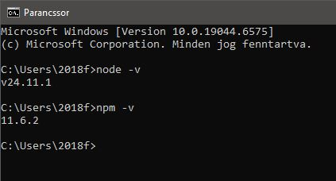
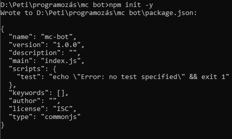
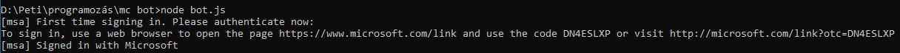
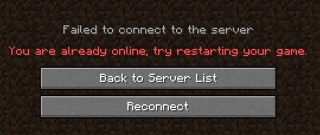

# 🕹️ MC Bot Tutorial 🚀

Welcome to this repository! In this tutorial, I will guide you **step by step** on how to create a **Minecraft bot** 🤖 that can **join servers** 🌍 and interact within the game 🎮.


## 1️⃣ Install Node.js 🟢

First, download and install **Node.js** from the official website: [Node.js Official Site](https://nodejs.org/en)  

After installation, open your **command prompt** (or terminal) and check if Node.js and npm are installed correctly by running:  

```bash
node -v  
npm -v  
```


## 2️⃣ Create the project folder 📂

Create a new folder where the bot files will be stored, then navigate into it in your terminal. After that, initialize the Node.js project:  

```bash
mkdir mineflayer-bot
cd mineflayer-bot
npm init -y
```



## 3️⃣ Install Mineflayer 🤖

Now that your project is set up, you can install **Mineflayer**, the library that allows us to create Minecraft bots. Run the following command in your project folder:

```bash
npm install mineflayer
```
## 4️⃣ Create your bot.js file 📝

Next, create a file called **bot.js** in your project folder and paste the following code into it:

```javascript
const mineflayer = require('mineflayer')

const bot = mineflayer.createBot({
  auth: 'microsoft',
  host: 'serverip', 
  port: 25565,
  username: 'email@gmail.com', 
  version: '1.20.2'
})

bot.on('spawn', () => {
  console.log("Bot joined on the server!")
})
```

## 5️⃣ Run your bot 🚀

After filling in your server and account information in **bot.js**, run the script with:

```bash
node bot.js
```
If everything is correct, you should see something like this:



Next, copy the link from the console and log in with your Microsoft account. Once you've done that, you should immediately see:

```bash
Bot joined on the server!
```

If you did everything correctly, you should see something like this:


This means that your bot is now connected to the server. Keep in mind that while the bot is online, you may not be able to log in with your own account at the same time.

