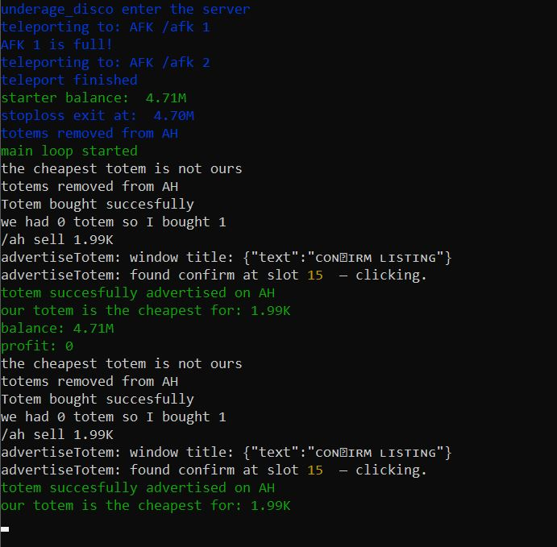
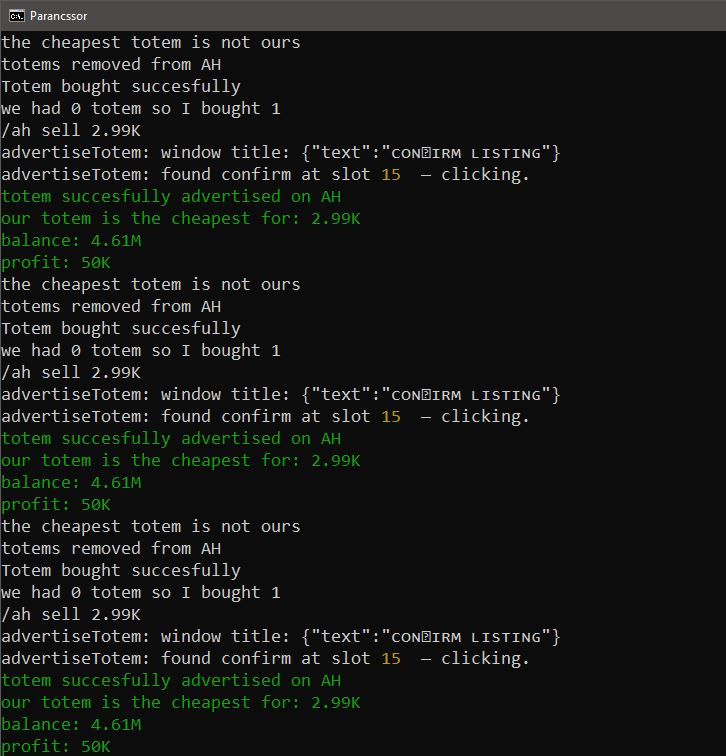

# 🟩 Totem Reseller Bot – DonutSMP (donutsmp.net)

This project is an **automated Minecraft reselling bot**, designed specifically for the **DonutSMP** server.  
Its operation is simple but extremely powerful:

👉 It buys **totems from the shop for $1500**,  
👉 then **resells them on the Auction House for a higher price**,  
👉 generating approximately **$10,000 every 10 minutes**, or **~$60,000 per hour**  
*(depending on totem supply & demand)*.

The system is fully automated and requires minimal user interaction.

---

## 📌 Table of Contents
- [⚙️ Requirements](#️-requirements)
- [🔧 Core Features](#-core-features)
- [🔄 Step-by-Step How It Works](#-step-by-step-how-it-works)
- [🖼️ Gallery](#️-gallery)
- [📥 Installation](#-installation)

---

# ⚙️ Requirements

Before running the bot, make sure the following items are configured:

### **0. Mineflayer**
The bot requires Mineflayer to run.  
Detailed installation guide: **[Mineflayer Installation](Install.md)**

### **1. Mojang Authentication (Email)**
In the `createBot()` call, enter your **own Mojang account email address** — this is how the bot logs into the server.

### **2. StopLoss**
It is strongly recommended to set a **StopLoss of at least 10K**.  
This prevents the bot from buying totems during unfavorable market conditions.

---

# 🔧 Core Features

Below are the main functions included in the current version of the bot:

### ✔ **Logging Functions**  
`errLog(...parts)` and the two other small functions at the top handle all error and status logging.

### ✔ **Delay Utility**  
`delay(ms)` is used for general timing and timeout control.

### ✔ **Totem Counter**  
`countTotemsInInventory()` counts how many totems are currently in the bot’s inventory.

### ✔ **Convert Number → AH Price Format**  
`formatAHPrice(rawPrice)` converts numeric values into AH-style price strings (e.g. `10000` → `10K`).

### ✔ **Convert AH Price → Number**  
`parsePrice(priceStr)` converts formatted prices back into numeric values (e.g. `10K` → `10000`).

### ✔ **Totem Advertisement**  
`advertiseTotem(price, timeoutMs = 10000)` lists a totem on the AH:  
➡️ It posts **$10 cheaper** than the given price.  
➡️ This ensures **your listing is always the cheapest**, so players always buy yours first.

### ✔ **Find Cheapest Totem + Seller**  
`checkCheapestTotemPriceAndSeller()` returns the AH's cheapest totem and the seller’s name.

### ✔ **Teleport to AFK Area**  
`tpToAFK()` sends the bot to the AFK area for stable operation.

### ✔ **Buy Totem From Shop**  
`buyTotemFromShop()` purchases a totem for **$1500**.

### ✔ **Buy Totem From AH** *(not implemented yet)*  
`buyTotemFromAH()` would buy a cheap AH totem if it is priced under **$1500**.

### ✔ **Delete All Own AH Listings**  
`deletTotemsFromAh()` clears all the bot's active Auction House listings.

### ✔ **Get Player Balance**  
`getBalance(timeoutMs = 8000)` retrieves the player's current in-game balance.

### ✔ **Main() – Core Logic**  
This is the brain of the bot:
- Teleport to AFK  
- Delete existing listings  
- Check cheapest AH totem  
- Buy from shop / list on AH  
- Print profit & status  
- StopLoss control  
- Repeat forever in a loop  

---

# 🔄 Step-by-Step How It Works

1. **The bot logs in** using your Mojang email.  
2. After spawning, it **teleports to the AFK area**.  
3. It **clears all existing AH listings**.  
4. It checks **the cheapest totem** on the Auction House.  
5. If the bot is not the cheapest and the cheapest price ≥ **$1520**, it:  
   - buys a totem if needed,  
   - lists its own totem → *cheapest - 10*.  
6. It **prints balance, profit, and activity status**.  
7. **StopLoss check** runs continuously.  
8. The process loops infinitely.

---

# 🖼️ Gallery

---

# 📥 Installation

Full installation instructions can be found here:

👉 **[Installation.md](Installation.md)**

---
👉 **[Previous_versions.md](Previous_versions.md)**
---
Thank you for checking out the project!  
